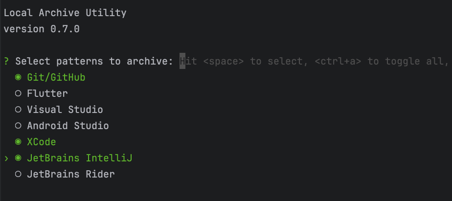

# Local Archive Utility (LOAR)

Utility to archive local only stuffs, which is NOT tracked by git, yet don't want to lose them while changing working computers or re-installing OS.

### How to use it:

#### (a) Easy way
1. Install using  (for Ubuntu, Debian, Fedora, CentOS, Arch Linux, Manjaro, openSUSE, Solus, and Zorin OS) 
```bash
sudo snap install loar <enter>
```
2. Goto your repository directory
```bash
cd {your-repo-directory} <enter>
```
3. run loar, and follow 1st time guide 
```bash
loar <enter>
```


#### (b) directly from GitHub (if you want to install loar, only for your project)
1. Download [latest release](https://github.com/cavecafe-cc/loar/releases/latest/), choose ZIP file for your OS and CPU types
2. Unzip it, copy 'loar' to your project root directory
4. Make the binary as executable by `chmod +x <your project repo root>/loar`
5. Run it from a root directory of a git repository
```bash
> ./loar <enter>
```

#### Rest of the Steps

1. It will ask your project types to archive. Choose the number of the project type you want to archive. (no harm to select all)


2. lastly, it will ask your backup location, typically any 'secure' Cloud storage folder (i.e. iCloud, OneDrive, Google Drive, etc.)

```bash
   ✔ Enter archive directory for your local only files (somewhere secure and safe): ../com~apple~CloudDocs/my-archive
   Archive created at: ../com~apple~CloudDocs/my-archive/loar_2024-10-07-071012_my-project_vesta.zip
   PLEASE make sure your ZIP file is in SAFE location, in case your local files may contains some secrets.
```

3. Done! Your local only stuffs are archived. You can find the ZIP file in the location you specified by the following name format.
```bash
loar_{yyyy-MM-dd-hhMMss}_{your-repo-name}_{your-computer-name}.zip
```